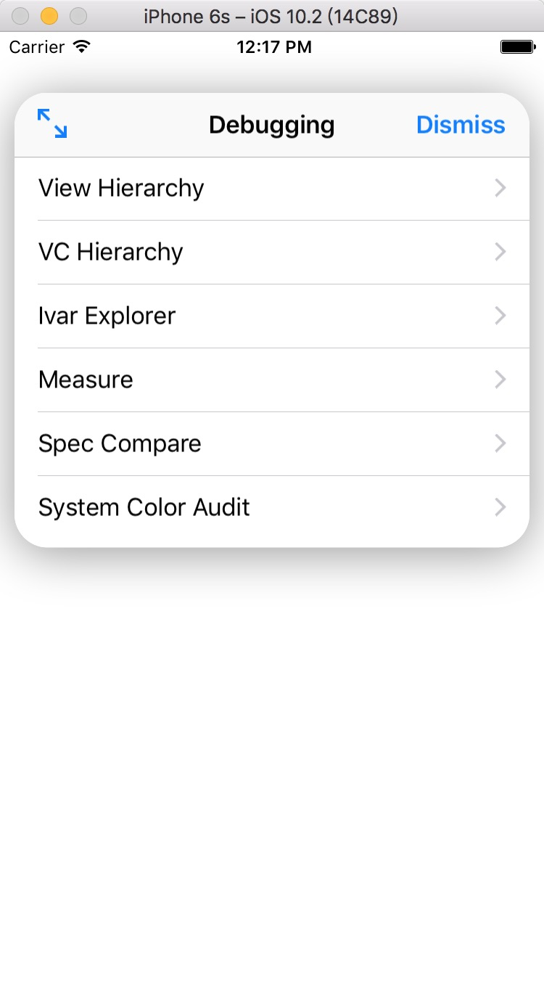
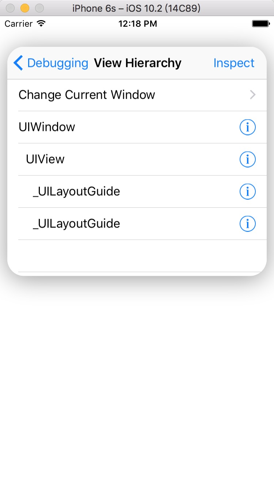
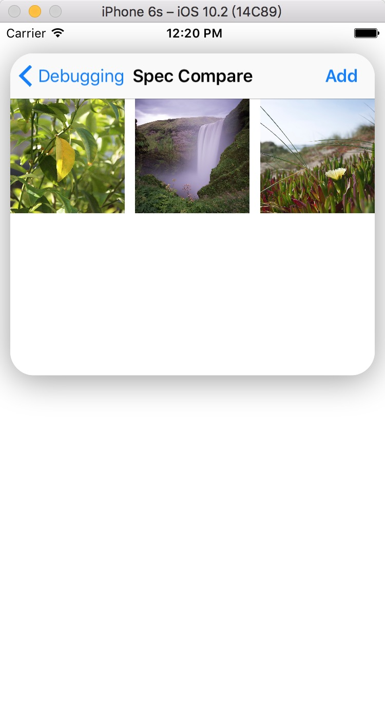
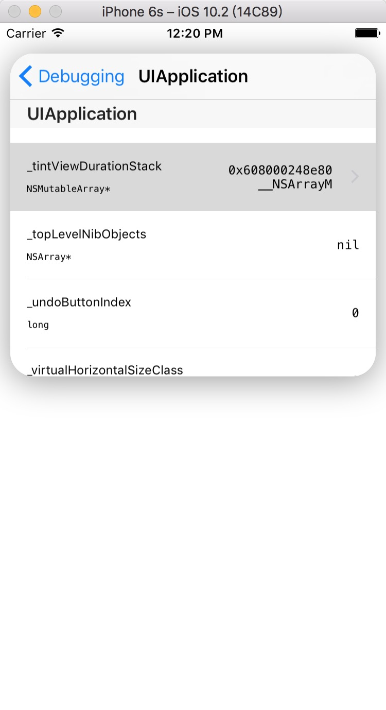
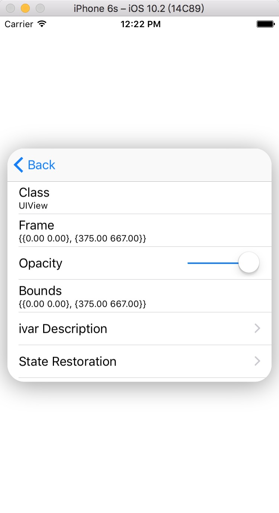
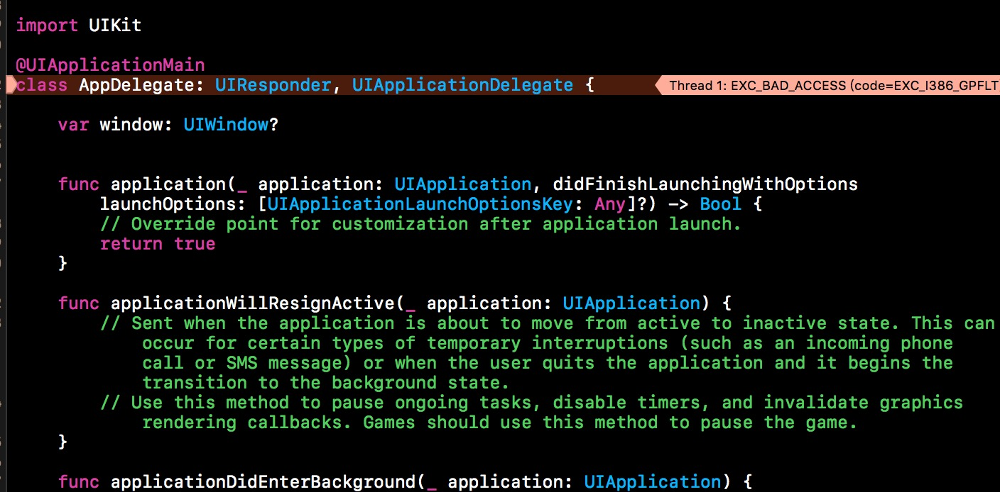

# AppleDebugPanelDemo

苹果私有 Debug 工具示例项目，原文链接：[UIDebuggingInformationOverlay](http://ryanipete.com/blog/ios/swift/objective-c/uidebugginginformationoverlay/)

# 截图

# 问题

使用的过程中发现 **Ivar Explorer** 选中某个 cell 的时候会 Crash，如图：

